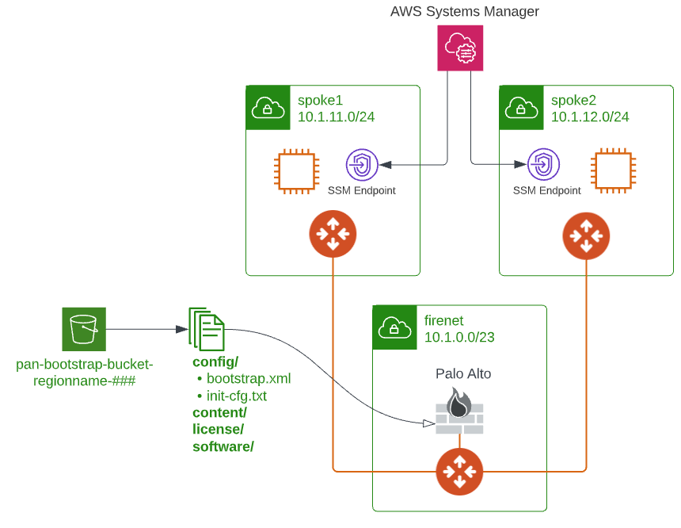

# Aviatrix Firenet Palo Alto Networks on AWS Demo

The code provided is for demo purposes only.



## Prerequisites

Please make sure you have:
- Aviatrix Controller 6.6
- AWS access accounts are onboarded. 

## Environment Variables

To run this project, you will need to set the following environment variables

Variables | Description
--- | ---
AVIATRIX_CONTROLLER_IP | Aviatrix Controller IP or FQDN 
AVIATRIX_USERNAME | Aviatrix Controller Username
AVIATRIX_PASSWORD | Aviatrix Controller Password
TF_VAR_aws_account | AWS Aviatrix Account 

## Run Locally

Clone the project

```bash
git clone https://github.com/bayupw/avx-aws-firenet-pan-demo
```

Go to the project directory

```bash
cd avx-aws-firenet-pan-demo
```

Set environment variables

```bash
export AVIATRIX_CONTROLLER_IP="aviatrixcontroller.aviatrix.lab"
export AVIATRIX_USERNAME="admin"
export AVIATRIX_PASSWORD="aviatrix123"
export TF_VAR_aws_account="AWS-Aviatrix-Account"
```

Optional environment variables

```bash
export TF_VAR_enable_gwlb=true
```

Terraform workflow

```bash
terraform init
terraform plan
terraform apply -auto-approve
```
## Inputs

| Name | Description | Default | Required |
|------|-------------|---------|----------|
| aws_region | AWS Region | `ap-southeast-2` | no |
| aws_iam_role | Bootstrap IAM role name | `bootstrap-VM-S3-role` | no |
| aws_iam_policy | Bootstrap IAM policy | `bootstrap-VM-S3-policy` | no |
| bootstrap_bucket | Bootstrap S3 bucket name | `pan-bootstrap-bucket` | no |
| aws_account | AWS Account for Aviatrix Controller | `aws-account` | yes |
| firenet_vpc | Firenet VPC name | `firenet-vpc` | no |
| firenet_vpc_cidr | Firenet VPC CIDR block size | `10.0.0.0/23` | no |
| firenet_gw | Firenet gateway name | `firenet-gw` | no |
| firenet_gw_size | Transit firenet gateway size | `c5.xlarge` | no |
| fw_instance_name | Firewall instance name | `fw-instance` | no |
| fw_instance_size | Firewall instance size | `m5.xlarge` | no |
| enable_gwlb | Enable AWS Gateway Load Balancer | `false` | no |
| key_name | Existing SSH public key name | `null` | no |